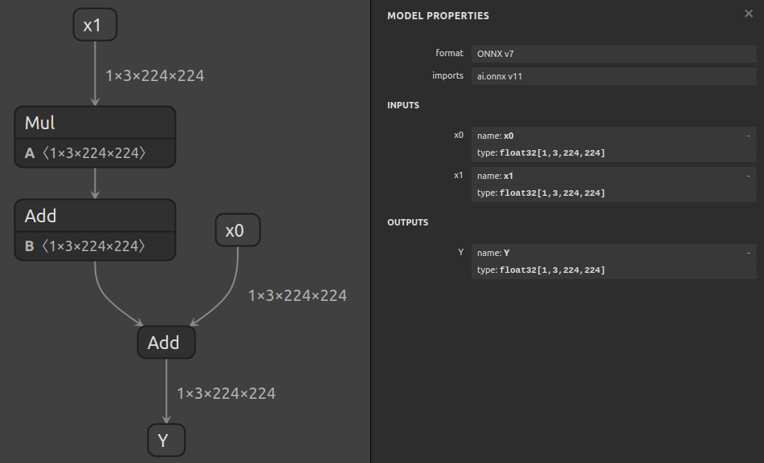
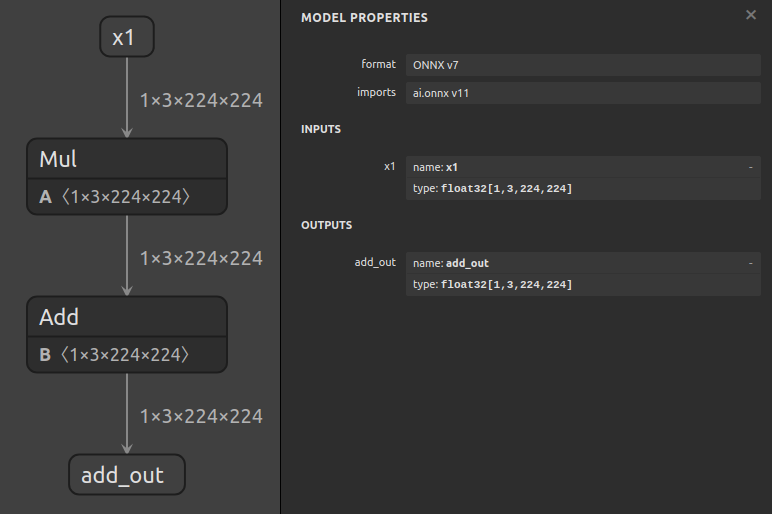

# Using Extract To Isolate A Subgraph

使用`extract`来隔离子图.

## 引言

`surgeon extract`子工具可以用一个命令从模型中提取子图。

在这个示例中，我们将从一个计算 `Y = x0 + (a * x1 + b)` 的模型中提取一个子图：



假设我们想要隔离计算 `(a * x1 + b)` 的子图，并且我们已经使用 `polygraphy inspect model model.onnx --show layers` 来确定了该子图的输入/输出张量的名称，但我们不知道任何涉及张量的形状或数据类型。

当形状和数据类型未知时，您可以使用 `auto` 来指示 Polygraphy 应尝试自动确定这些值。
对于输入，我们必须同时指定形状和数据类型，而输出只需要数据类型 - 因此 `--inputs` 需要 2 个 `auto`，`--outputs` 需要 1 个。

## 运行示例

1. 提取子图：

   ```bash
   polygraphy surgeon extract model.onnx \
       --inputs x1:auto:auto \
       --outputs add_out:auto \
       -o subgraph.onnx
   ```

   如果我们知道形状和/或数据类型，我们可以改为写，例如：

   ```bash
   polygraphy surgeon extract model.onnx \
       --inputs x1:[1,3,224,224]:float32 \
       --outputs add_out:float32 \
       -o subgraph.onnx
   ```

   结果的子图将如下所示：

   

2. **[可选]** 此时，模型已准备好使用。您可以使用 `inspect model` 来确认它是否正确：

   ```bash
   polygraphy inspect model subgraph.onnx --show layers
   ```

## 关于`auto`的说明

当将 `auto` 指定为形状或数据类型时，Polygraphy 依赖于ONNX形状推断来确定中间张量的形状和数据类型。

在ONNX形状推断无法确定形状的情况下，Polygraphy 将使用带有合成输入数据的ONNX-Runtime在模型上运行推断
您可以使用 `--model-inputs` 参数来控制此输入数据的形状，使用 `Data Loader` 选项来控制其内容。

这将导致生成子图的输入具有固定形状。您可以再次在子图上使用 `extract` 命令，并指定相同的输入，但使用具有动态维度的形状，例如 `--inputs identity_out_0:[-1,-1]:auto`，以将它们更改回动态形状。
