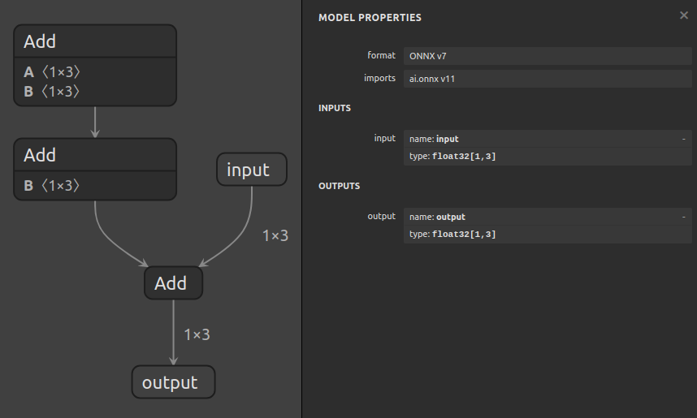
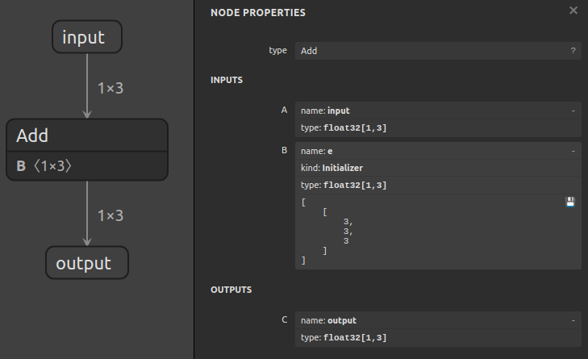

# Using Sanitize To Fold Constants

使用Sanitize折叠常数.

## 简介

`surgeon sanitize`子工具可用于折叠图中的常数，删除未使用的节点，并对节点进行拓扑排序。在形状静态已知的情况下，它还可以简化涉及形状操作的子图。

在本示例中，我们将折叠一个计算 `output = input + ((a + b) + d)` 的图中的常数，其中 `a`、`b` 和 `d` 是常数：




## 运行示例

1. 执行以下命令来折叠常数：

   ```bash
   polygraphy surgeon sanitize model.onnx \
       --fold-constants \
       -o folded.onnx
   ```

   这将折叠 `a`、`b` 和 `d` 到一个常数张量中，并且生成的图计算 `output = input + e`：

   

   *提示: 有时，模型中包含像 `Tile` 或 `ConstantOfShape` 这样的操作，可能会生成大型的常数张量。折叠这些张量可能会使模型大小膨胀到不可接受的程度。您可以使用 `--fold-size-threshold` 来控制要折叠张量的最大大小（以字节为单位）。生成超过此限制的张量的节点将不会被折叠，而是在运行时计算。*

2. **[可选]** 您可以使用 `inspect model` 来确认它是否看起来正确：

   ```bash
   polygraphy inspect model folded.onnx --show layers
   ```
