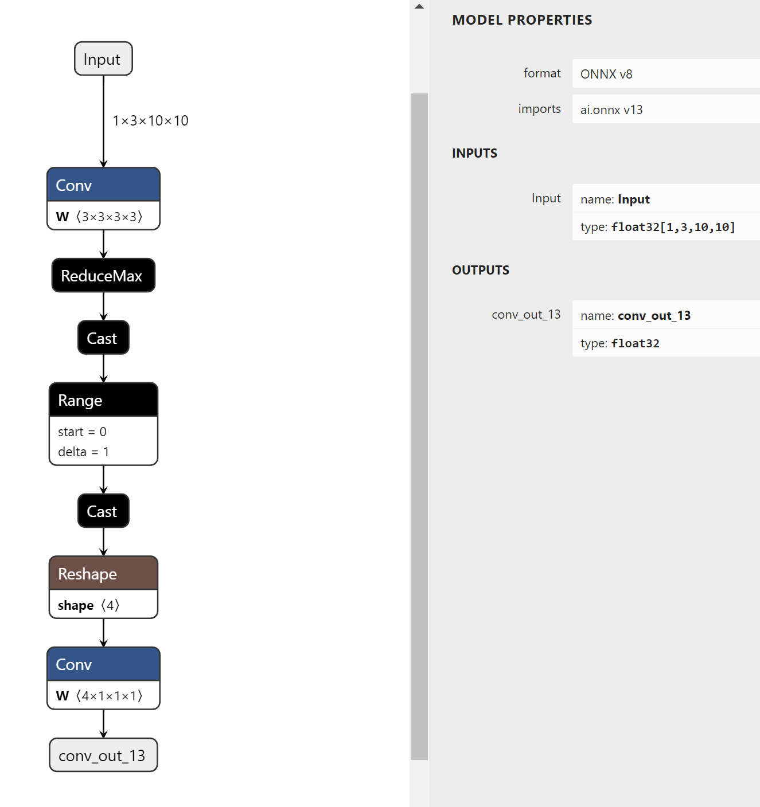

# Using Sanitize To Set Upper Bounds For Unbounded Data-Dependent Shapes (DDS)

使用 Sanitize 来为无界数据相关形状（DDS）设置上界.

## 简介

`surgeon sanitize`子工具可用于为无界数据相关形状（DDS）设置上界。
当一个张量的形状取决于另一个张量的运行时值时，这样的形状被称为DDS。
一些DDS具有有限的上界。例如，`NonZero` 运算符的输出形状是一个DDS，但其输出形状不会超过其输入的形状。
而另一些DDS没有上界。例如，当 `limit` 输入是运行时张量时，`Range` 运算符的输出具有无界DDS。
具有无界DDS的张量对于TensorRT在构建器阶段优化推理性能和内存使用是困难的。
在最坏的情况下，它们可能导致TensorRT引擎构建失败。

在这个示例中，我们将使用Polygraphy来为图中的无界DDS设置上界：



## 运行示例

1. 首先对模型运行常量折叠：

   ```bash
   polygraphy surgeon sanitize model.onnx -o folded.onnx --fold-constants
   ```

   请注意，常量折叠和符号形状推断对于列出无界DDS并设置上界是必需的。

2. 使用以下命令查找具有无界DDS的张量：

   ```bash
   polygraphy inspect model folded.onnx --list-unbounded-dds
   ```

   Polygraphy将显示所有具有无界DDS的张量。

3. 使用以下命令为无界DDS设置上界：

   ```bash
   polygraphy surgeon sanitize folded.onnx --set-unbounded-dds-upper-bound 1000 -o modified.onnx 
   ```

   Polygraphy将首先查找所有具有无界DDS的张量。
   然后，它将插入min运算符，其提供的上界值用于限制DDS张量的大小。
   在这个示例中，在 `Range` 运算符之前插入了一个min运算符。
   使用修改后的模型，TensorRT将知道 `Range` 运算符的输出形状不会超过1000。
   因此，可以为后续层选择更多的内核。

   

4. 检查现在是否没有具有无界DDS的张量：

   ```bash
   polygraphy inspect model modified.onnx --list-unbounded-dds
   ```

   修改后的.onnx 现在不应该包含无界DDS。